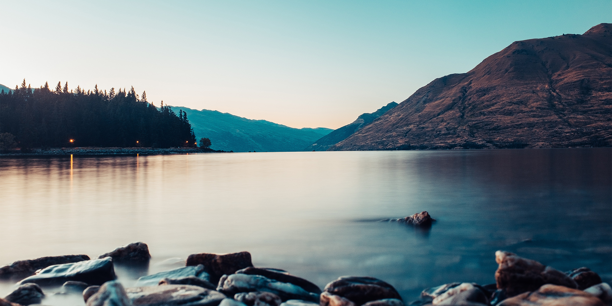

The Jola (or Diola) people are the predominant ethnic group in the Cassamance region of Senegal. They are renowned for their wild dance ceremonies, which are heavily influenced by their animistic beliefs. Abene Festival is a week long showcase of music and dance. It's a great place to experience these ceremonies.

<figure>
  
  <figcaption>Real nice lake!</figcaption>
</figure>
